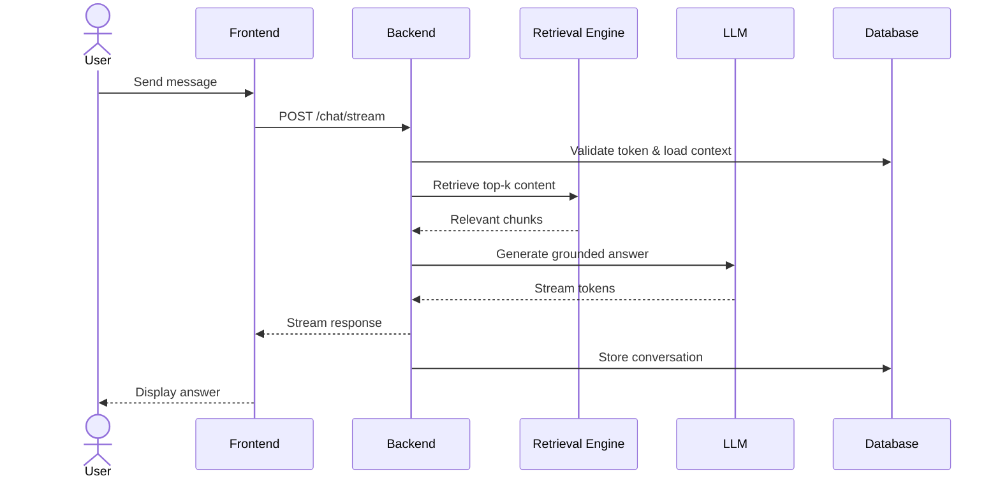

# System Blueprint — Internal Real Estate AI Chatbot
## System Flow & Use Cases

**Version:** 1.0  
**Status:** Draft  
**Scope:** Internal AI-powered assistant for real estate agents (RAG-based, authenticated access only)

---

# 1. System Overview

The Internal Real Estate AI Chatbot is a secure, authenticated, retrieval-augmented AI assistant designed to help agents answer project and website-based questions accurately.

The system:

- Requires login (no anonymous access)
- Enforces role-based access (Agent / Admin)
- Uses Retrieval-Augmented Generation (RAG)
- Prevents hallucination (answers only from indexed content)
- Logs conversations and feedback
- Allows Admin to manage knowledge ingestion

---

# 2. Actors

| Actor | Description |
|--------|------------|
| **Agent** | Authenticated internal user who uses the chatbot |
| **Admin** | Internal user with additional content management permissions |
| **AI System** | Backend + Retrieval Engine + LLM |
| **Database** | Stores users, conversations, content, logs |
| **LLM Provider** | External language model used for response generation |

---

# 3. High-Level System Flow
```
User → Login → Chat Interface → Send Message
→ Safety Check → Retrieval
→ Grounded Prompt → LLM Generation
→ Stream Response → Store Conversation
```

---

# 4. Core Use Cases

---

## UC-01: User Login

### Actor
Agent / Admin

### Preconditions
- User has a valid account

### Main Flow
1. User opens internal web application
2. User navigates to `/login`
3. User enters credentials
4. Backend validates credentials
5. JWT/session token issued
6. User redirected to `/chat`

### Alternate Flow
- Invalid credentials → show error
- Expired token → require re-login

### Postcondition
User is authenticated and can access chat.

---

## UC-02: Start New Chat

### Actor
Agent / Admin

### Preconditions
User is authenticated.

### Main Flow
1. User clicks “New Chat”
2. System creates new conversation record
3. Empty chat thread displayed
4. Input box focused

### Postcondition
Conversation created and ready.

---

## UC-03: Send Message (Core RAG Flow)

### Actor
Agent / Admin

### Preconditions
- Active authenticated session
- Chat conversation exists

---

### Main Flow

1. User types question
2. Frontend sends `POST /chat/stream`
3. Backend validates:
   - Token
   - Role
4. Load recent conversation messages
5. Run safety pre-check:
   - Injection attempts
   - Unauthorized request
6. Rewrite follow-up into standalone query (if needed)
7. Perform vector search (top-k retrieval)
8. Check retrieval confidence threshold
9. If sufficient evidence:
   - Build grounded prompt
   - Call LLM
   - Stream response
10. Store:
    - User message
    - Assistant response
    - Retrieval metadata
    - Logs

---

### Alternate Flows

| Scenario | System Response |
|----------|-----------------|
| Safety violation | Refuse response |
| Retrieval low confidence | "Information not available in knowledge base." |
| LLM error | Return safe fallback error |

---

### Postcondition
Grounded response delivered and stored.

---

## UC-04: Follow-Up Question (Memory)

### Actor
Agent / Admin

### Preconditions
Conversation has previous messages.

### Main Flow
1. User sends follow-up (e.g., "Where is that located?")
2. Backend loads recent context
3. Rewrite into standalone query
4. Retrieval runs
5. Generate grounded answer
6. Stream and store

### Postcondition
Context-aware answer generated safely.

---

## UC-05: View Chat History

### Actor
Agent / Admin

### Preconditions
User has previous conversations.

### Main Flow
1. Sidebar loads conversations
2. User selects a conversation
3. Full message history displayed

### Security Rule
User can only access their own conversations.

---

## UC-06: Clear Conversation

### Actor
Agent / Admin

### Main Flow
1. User clicks “Clear”
2. Frontend calls clear endpoint
3. Backend clears conversation messages (or marks as reset)
4. UI resets to empty thread

---

## UC-07: Submit Feedback

### Actor
Agent / Admin

### Main Flow
1. User clicks 👍 or 👎
2. `POST /feedback`
3. Feedback stored with:
   - message_id
   - user_id
   - timestamp

### Postcondition
Feedback logged for monitoring.

---

## UC-08: Admin Manage Knowledge Base

### Actor
Admin only

### Permissions Required
Admin role

---

### Main Flow — View Pages

1. Admin navigates to `/admin/content`
2. System lists indexed pages
3. Admin can see status, last updated time

---

### Main Flow — Reindex

1. Admin clicks “Reindex”
2. Backend starts ingestion process
3. Pages fetched → cleaned → chunked → embedded
4. Vector index updated

---

### Main Flow — Exclude URL

1. Admin selects page
2. Click “Exclude”
3. System removes chunks + embeddings
4. Page marked excluded

---

### Postcondition
Knowledge base updated and controlled.

---

# 5. End-to-End Sequence (Happy Path)



# 6. Security & Control Rules

- Authentication required for all endpoints except `/health`
- Role-Based Access Control (RBAC) enforced server-side
- No answer without retrieval evidence
- No cross-user data access
- All admin actions logged
- All conversations logged with timestamps
- Refusal required for unsafe or out-of-scope queries

---

# 7. Non-Functional Requirements

| Area | Requirement |
|------|------------|
| Response Time | First token streamed quickly |
| Data Isolation | Strict per-user conversation separation |
| Availability | Graceful fallback if LLM fails |
| Scalability | Support concurrent agent sessions |
| Logging | Full audit logs for admin actions |

---

# 8. System Boundaries

## Included

- Authentication  
- Chat  
- Retrieval  
- Knowledge ingestion  
- Feedback logging  
- Admin controls  

## Not Included

- Public anonymous chatbot  
- Direct MLS transactional actions  
- Payment processing  
- External CRM automation  

---

# 9. Summary

This blueprint defines a:

- Secure  
- Authenticated  
- RAG-based  
- Admin-controlled  
- Memory-aware  
- Non-hallucinating  

Internal AI Chatbot system for real estate agents.
